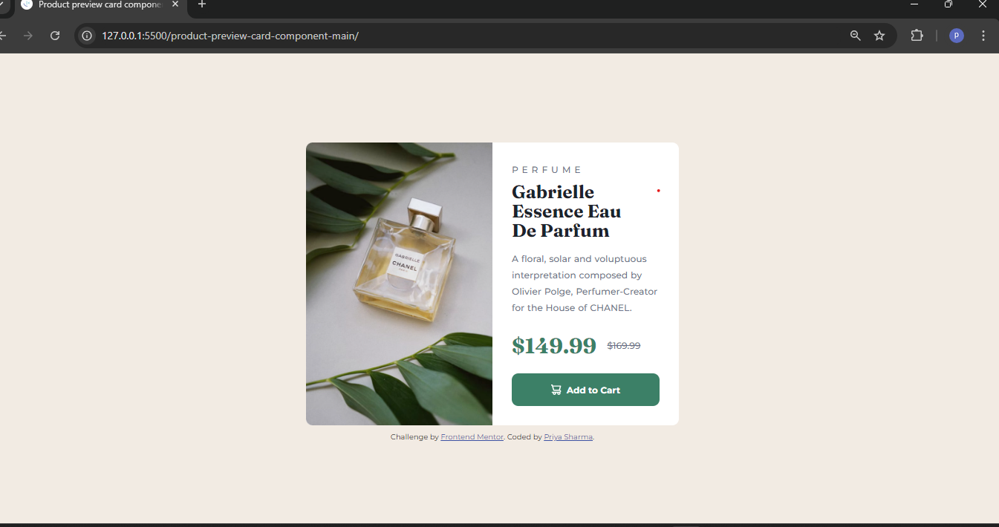

# Frontend Mentor - Product preview card component solution

This is a solution to the [Product preview card component challenge on Frontend Mentor](https://www.frontendmentor.io/challenges/product-preview-card-component-GO7UmttRfa). Frontend Mentor challenges help you improve your coding skills by building realistic projects. 

## Table of contents

- [Overview](#overview)
  - [The challenge](#the-challenge)
  - [Screenshot](#screenshot)
  - [Links](#links)
  - [Built with](#built-with)
  - [What I learned](#what-i-learned)
  - [Useful resources](#useful-resources)
- [Author](#author)

## Overview

This challenge was all about creating a responsive component which adapts different device sizes and looks beautiful.

### The challenge

Users should be able to:

- View the optimal layout depending on their device's screen size
- See hover and focus states for interactive elements

### Screenshot

### Links

- Solution URL: [Add solution URL here](https://github.com/PriyaSharma026/responsive-product-review-page)
- Live Site URL: [Add live site URL here](https://priyasharma026.github.io/responsive-product-review-page/)

### Built with

- Semantic HTML5 markup
- CSS custom properties
- Flexbox
- CSS Grid
- Sass pre-processor
- Mobile-first workflow

### What I learned

During the project I learnt:
- Sass pre-processor which is a css extension helps you in writing your code in more readable, managable and modular form.
- How to create resoponsive designs and how to use media queries
- How to use the powerful properties of css like flex, grid and css units to make designs responsive

### Useful resources

- ChatGpt really helped me alot while I got stuck somewhere or when I made some mistakes during the project. So if you stuck anywhere It will give you exact solution to your problem.

## Author

- LinkedIn - [@PriyaSharma](https://www.linkedin.com/in/priya-sharma26/)
